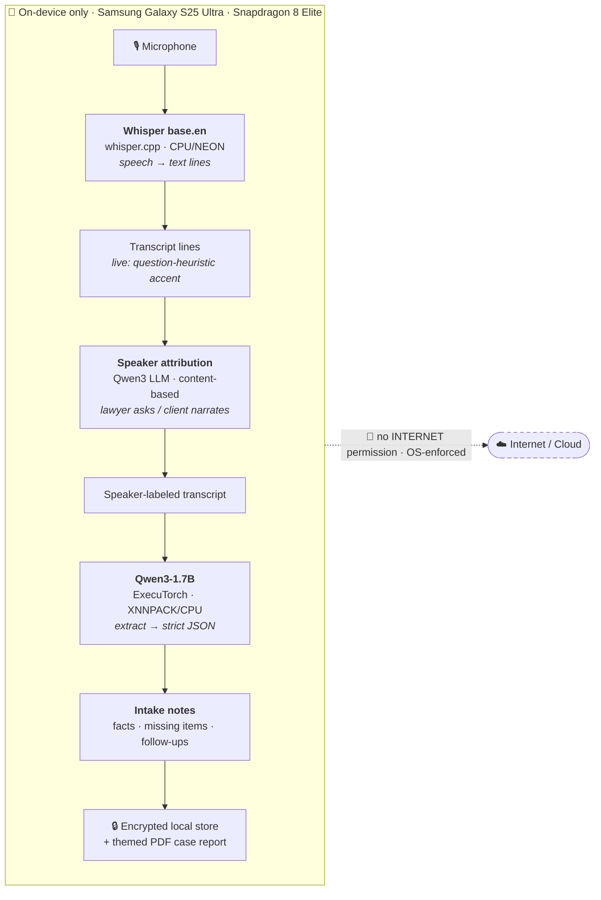
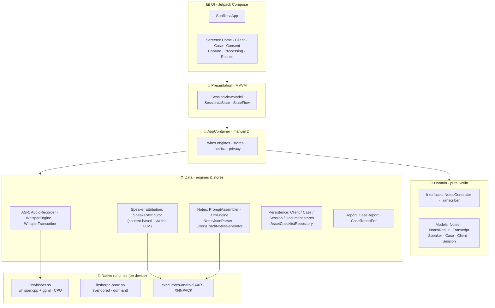
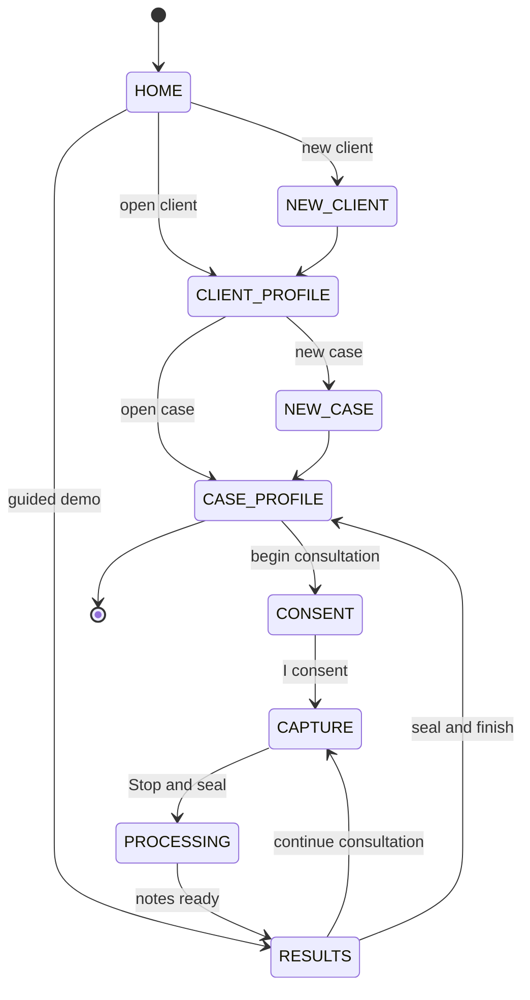
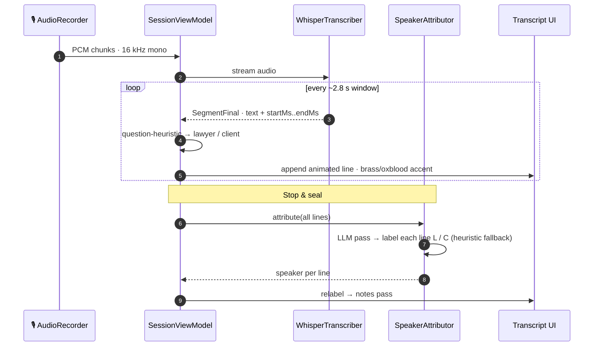
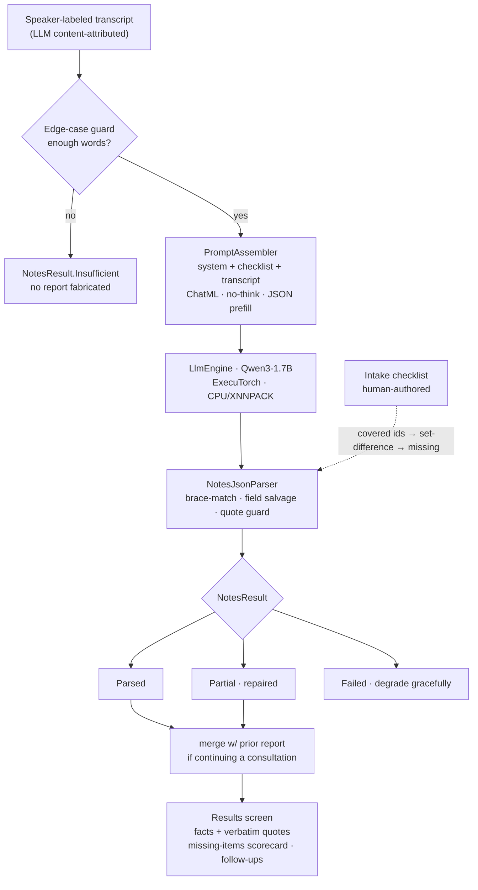
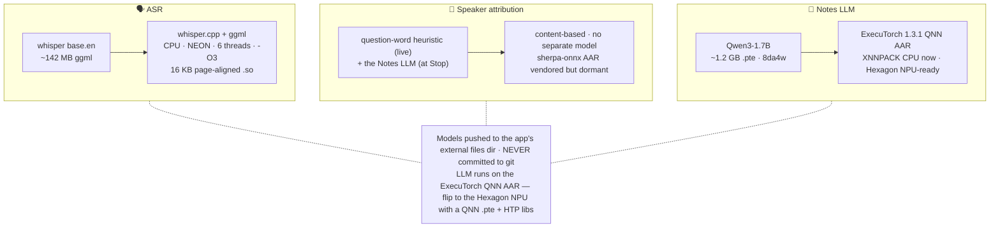
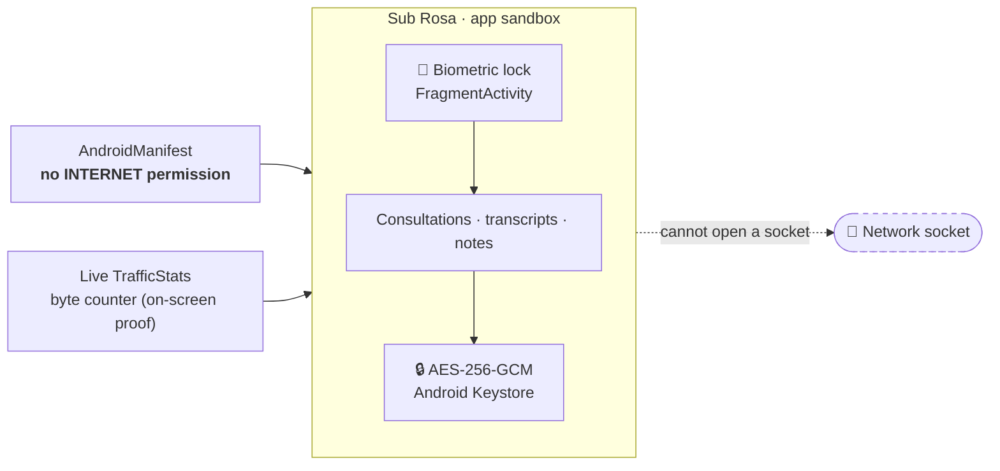
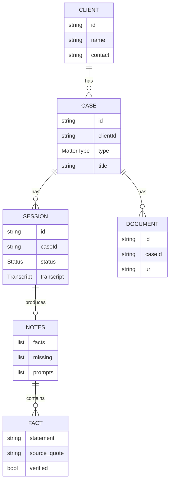

# Sub Rosa — Architecture

On-device AI legal-intake note-taker for the **Qualcomm × Meta ExecuTorch Hackathon**.
Records a lawyer's first client consultation → transcribes → attributes speakers by content → extracts structured
intake notes — **100% on-device, fully offline**.

> **Living document.** These diagrams reflect the current build. Update the relevant diagram whenever the
> architecture changes. Rendered by GitHub, VS Code, `mermaid.live`, and most slide tools.
>
> _Last updated: 2026-06-28_

---

## 1. System overview — the on-device pipeline

---

## 2. Layered architecture (Android app)

Single Gradle module, Jetpack Compose, single Activity, **manual DI** (`AppContainer`), MVVM with
**enum-driven phase navigation** (no Nav-Compose).

---

## 3. Consultation flow (phase navigation)

---

## 4. Live capture & content-based speaker attribution

Whisper streams the mic into committed lines; each line gets an **instant question-word heuristic** label
(lawyer asks / client narrates) shown as a brass/oxblood left accent. At **Stop**, the LLM reads the whole
transcript and authoritatively labels every line — content, not voiceprints.

> **Design note.** Acoustic diarization (pyannote/sherpa-onnx + a greedy voiceprint matcher) was tried
> first but failed on similar voices through one mic. Content attribution — the lawyer drives with
> questions, the client narrates — is reliable for an intake and needs no audio buffer.

---

## 5. Notes generation (LLM → strict JSON)

Legal competence lives in **human-authored checklists + the system prompt**, not in the weights — the
model only extracts, reformats, and the app computes the missing items by set-difference.

---

## 6. On-device models & runtimes

---

## 7. Privacy & trust model

---

## 8. Data & persistence

> Stores are JSON (`kotlinx.serialization`) in the app's private `filesDir`, encrypted at rest. The
> **case report** aggregates *all* of a case's consultations (combined facts, intersected missing items)
> into a themed PDF — shareable or saved to Downloads as `SubRosa_<Client>_<Case>.pdf`.
