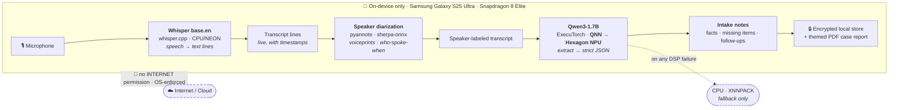
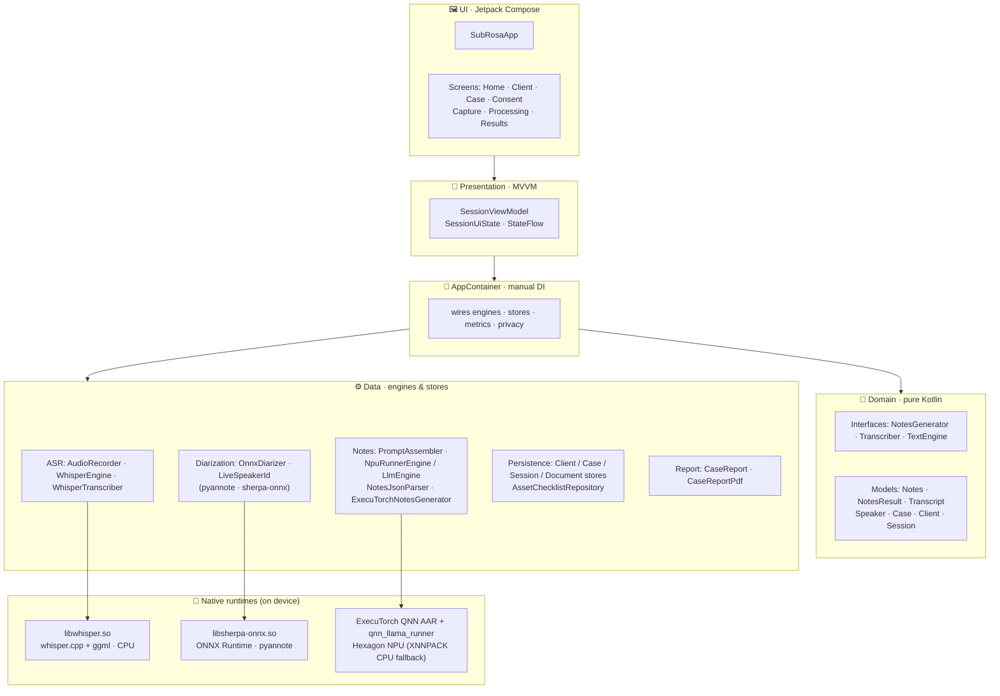
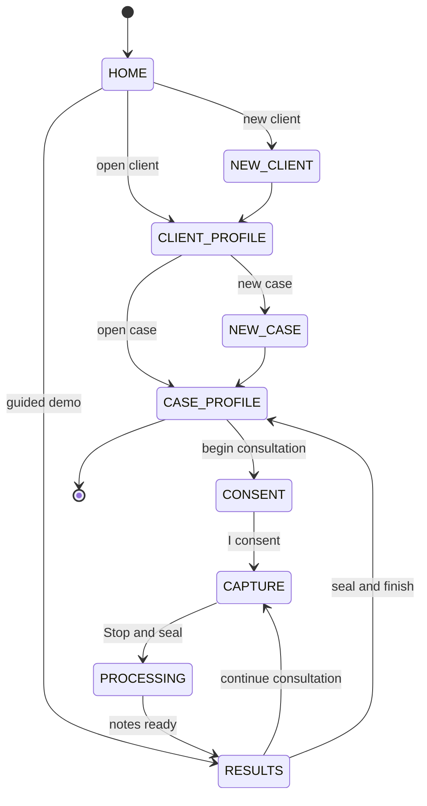
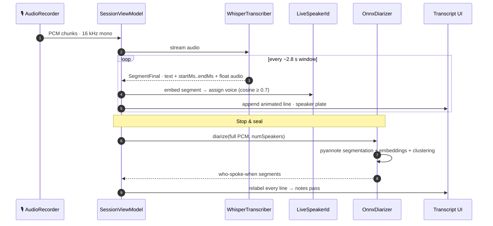
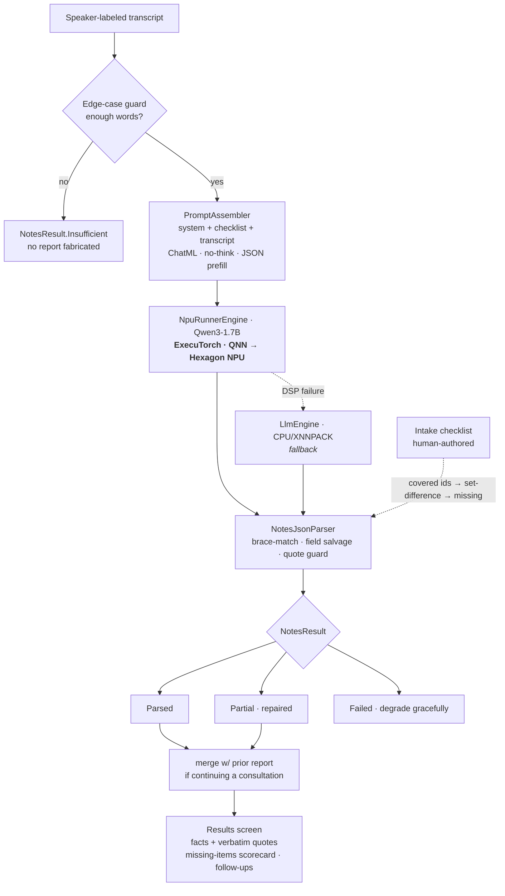
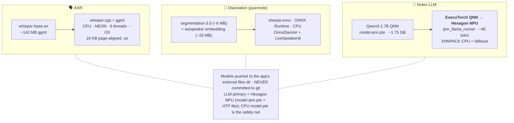
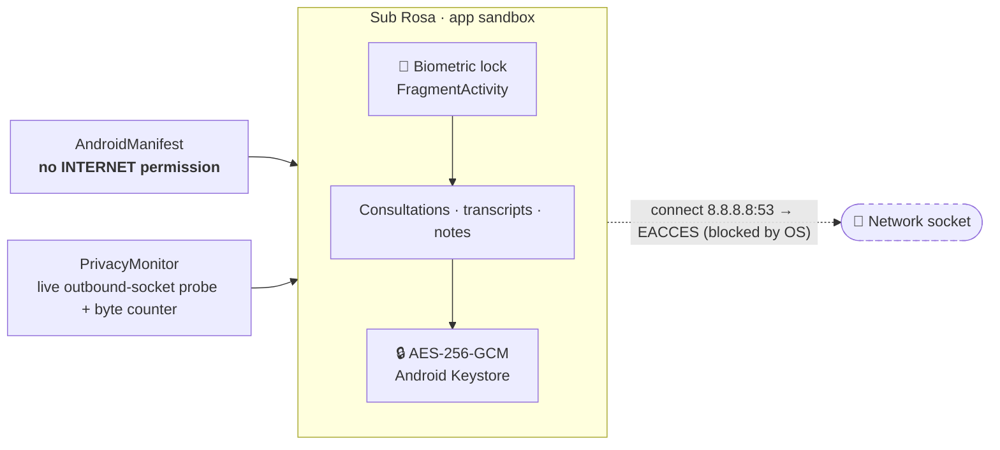
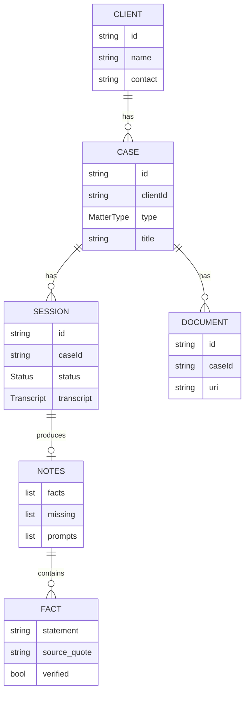

# Sub Rosa — Architecture

On-device AI legal-intake note-taker for the **Qualcomm × Meta ExecuTorch Hackathon**.
Records a lawyer's first client consultation → transcribes (Whisper) → diarizes speakers (pyannote) →
extracts structured intake notes on the **Hexagon NPU** — **100% on-device, fully offline**.

> **Living document.** These diagrams reflect the current build. Update the relevant diagram whenever the
> architecture changes. Rendered by GitHub, VS Code, `mermaid.live`, and most slide tools.
>
> _Last updated: 2026-06-28_

---

## 1. System overview — the on-device pipeline

The LLM runs on the **Hexagon NPU** through ExecuTorch's QNN backend. CPU/XNNPACK is a transparent
safety net, not the main path: `FallbackTextEngine` flips to it (and shows a red `CPU FALLBACK` chip)
only if the DSP fails mid-run.

---

## 2. Layered architecture (Android app)

Single Gradle module, Jetpack Compose, single Activity, **manual DI** (`AppContainer`), MVVM with
**enum-driven phase navigation** (no Nav-Compose).

---

## 3. Consultation flow (phase navigation)

---

## 4. Live capture & pyannote speaker diarization

Whisper streams the mic into committed lines with sample-offset timestamps. During capture,
`LiveSpeakerId` (sherpa-onnx voice embeddings) assigns each segment to a voice in real time. At
**Stop**, the full `OnnxDiarizer` pass (pyannote segmentation-3.0 + wespeaker embeddings + fast
clustering) refines every line, seeded by the **"people in the room"** count. The lawyer's manual
speaker tap always overrides, so the demo can never break.

> **Design note.** Acoustic diarization runs as a **post-Stop pass** (full pyannote is ~0.26× of audio
> duration — too slow to re-run continuously), with live voiceprints giving an instant in-capture split.
> Models are pushed to the device (`diarize-segmentation.onnx`, `diarize-embedding.onnx`), never committed.

---

## 5. Notes generation (LLM → strict JSON)

Legal competence lives in **human-authored checklists + the system prompt**, not in the weights — the
model only extracts and reformats, and the app computes the missing items by set-difference.

---

## 6. On-device models & runtimes

---

## 7. Privacy & trust model

---

## 8. Data & persistence

> Stores are JSON (`kotlinx.serialization`) in the app's private `filesDir`, encrypted at rest. The
> **case report** aggregates *all* of a case's consultations (combined facts, intersected missing items)
> into a themed PDF — shareable or saved to Downloads as `SubRosa_<Client>_<Case>.pdf`.
